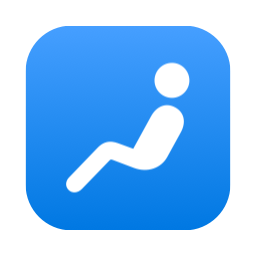
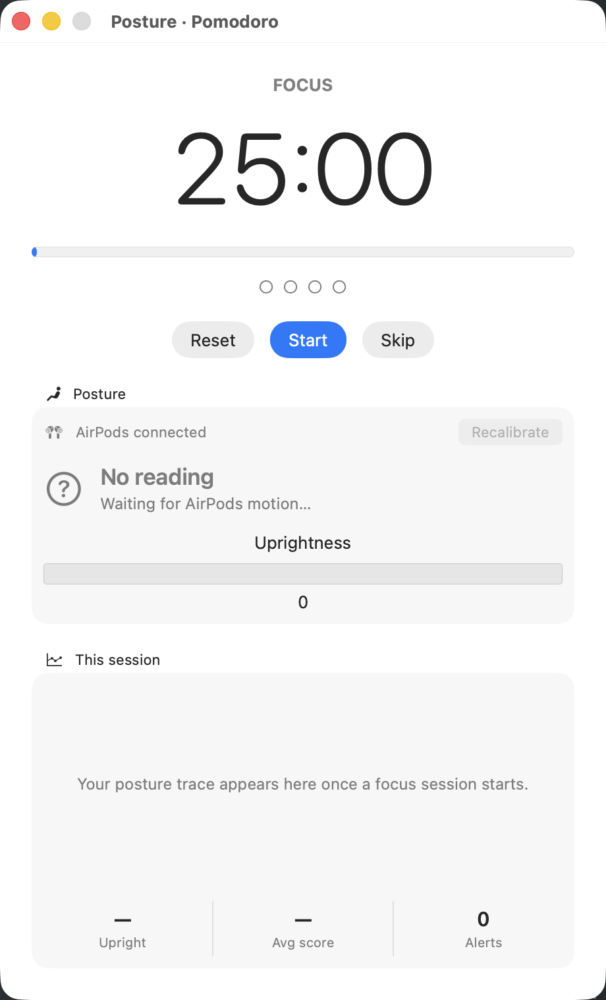
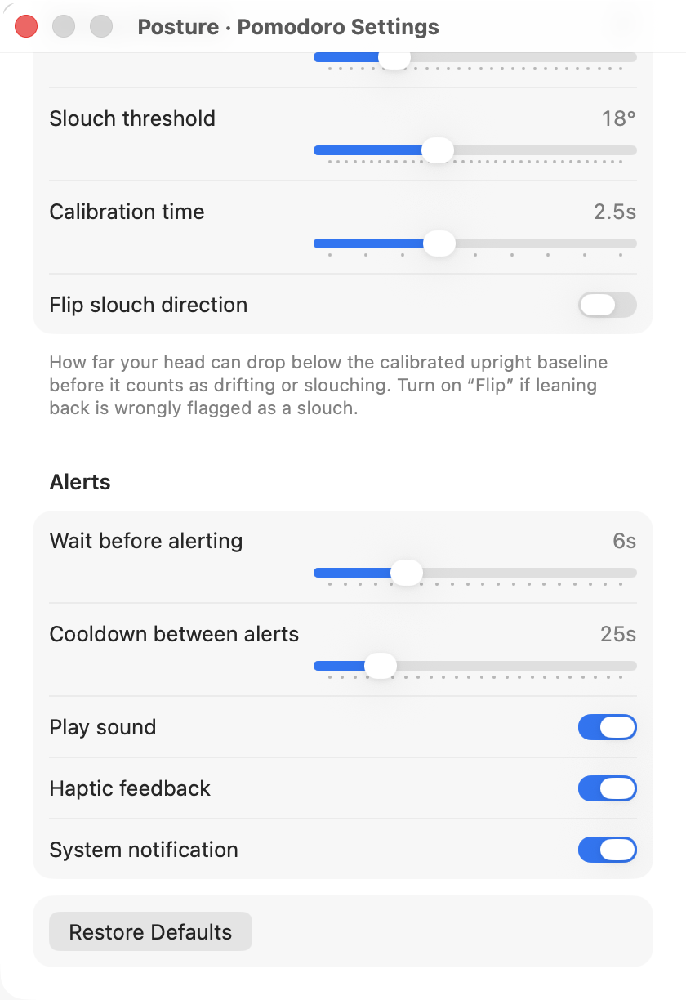

<p align="center">
  
</p>

<h1 align="center">Posture · Pomodoro</h1>

<p align="center">
  A macOS focus timer that uses your AirPods to catch you slouching — in the moment.
</p>

<p align="center">
  
  
  
  
</p>

Your AirPods already have motion sensors running the whole time they're in your ears — that's how Spatial Audio works. This app reads your head position from that **existing** stream. No new permission beyond Motion & Fitness, no extra battery drain, no hardware you don't already own.

It's a normal Pomodoro focus timer at its core. While you work, it watches your head angle. The second your posture drops it tells you — a sound, a haptic tap, a notification — and it charts your posture across the whole session so you can see exactly when you start to break down.

> Every fix for posture fails because nothing catches you in the act. The sensor that could was already in your ears.

## Screenshots

| Focus + live posture | Settings |
| --- | --- |
|  |  |

## How it works

- Reads head **attitude** (pitch) from [`CMHeadphoneMotionManager`](https://developer.apple.com/documentation/coremotion/cmheadphonemotionmanager) — the same IMU that drives Spatial Audio.
- When a focus block starts, it spends a couple of seconds **calibrating your upright baseline**.
- Live pitch is smoothed and compared to that baseline. The forward **drop**, in degrees, drives the state: **Upright → Drifting → Slouching**.
- Hold a slouch past the grace period and you get alerted; the dip is logged to the session chart.
- Posture is only tracked during **Focus** blocks — your breaks are your own.

## Features

- Classic Pomodoro cycle (focus / short break / long break) with a configurable round count
- Real-time head-posture tracking through AirPods motion
- In-the-moment slouch alerts: sound, haptics, and system notifications (each toggleable)
- Per-session posture chart (Swift Charts) plus stats: % upright, average score, alert count
- Fully native SwiftUI — stock components, system colors
- Everything configurable from a standard Settings window (⌘,), persisted across launches

## Requirements

- macOS 14 (Sonoma) or later
- Motion-capable headphones: AirPods (3rd gen or later), AirPods Pro, AirPods Max, or Beats with an H1/H2 chip
- Swift toolchain (Xcode 15+ or the Swift command-line tools) to build

## Build & run

```bash
git clone https://github.com/FujiwaraChoki/head-position-tracker.git
cd head-position-tracker
./build.sh            # compiles, assembles PostureTimer.app, ad-hoc signs it
open PostureTimer.app
```

Put your AirPods in first. On the first focus session macOS asks for **Motion & Fitness** permission — that's the only prompt.

> Build through `build.sh` rather than `swift run`: the motion API only works inside the signed `.app` bundle that carries the `NSMotionUsageDescription` from `Info.plist`.

## Package a DMG

```bash
./make_dmg.sh         # builds the app and produces PostureTimer.dmg
```

By default the app is **ad-hoc signed** (no Developer ID), so the first time you open it from the DMG, right-click → **Open** to get past Gatekeeper.

### Signed & notarized release

To produce a DMG that opens with a normal double-click on any Mac, sign with a Developer ID and notarize. With a `Developer ID Application` certificate and a [`notarytool` keychain profile](https://developer.apple.com/documentation/security/notarizing-macos-software-before-distribution):

```bash
CODESIGN_IDENTITY="Developer ID Application: NAME (TEAMID)" \
NOTARY_PROFILE="posture-notary" \
./notarize.sh
```

This signs the app (hardened runtime), notarizes and staples it, builds the DMG around the stapled app, then notarizes and staples the DMG. The [latest release](https://github.com/FujiwaraChoki/head-position-tracker/releases/latest) is built this way.

## Configure

Open **Settings** (⌘,). Everything persists to `UserDefaults`.

| Group | What you can set |
| --- | --- |
| **Timer** | Focus / short break / long break length, sessions before a long break |
| **Posture** | Drifting & slouch thresholds (°), calibration time, **Flip slouch direction** |
| **Alerts** | Grace period, cooldown between alerts, sound / haptics / notification toggles |

> **Flip slouch direction** covers sign-convention differences between AirPods models. If leaning *back* gets wrongly flagged as a slouch, flip it — no rebuild needed.

## Custom icon

The app icon is generated from an SF Symbol (`figure.seated.side`). To change it, edit `symbolName` in `make_icon.swift` and run:

```bash
./make_icon.sh
```

## Project layout

```
Sources/PostureTimer/
  PostureTimerApp.swift          # @main App + Settings scene
  ContentView.swift              # main window (timer, posture, session chart)
  SettingsView.swift             # grouped Form
  AppModel.swift                 # @Observable view model wiring it all together
  Settings.swift                 # persisted user settings
  Notifier.swift                 # sound / haptics / notifications
  Motion/MotionManager.swift     # CMHeadphoneMotionManager wrapper
  Model/                         # PomodoroTimer, PostureAnalyzer, SessionRecorder, PostureState
build.sh · make_dmg.sh · make_icon.sh · make_icon.swift
```

## License

MIT — see [LICENSE](LICENSE).
